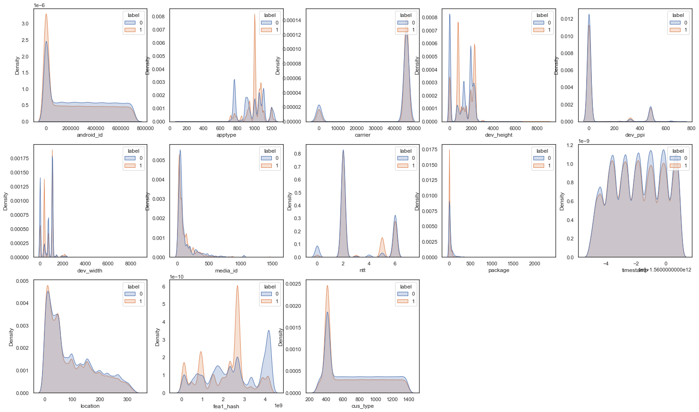

# MarTech Challenge 点击反欺诈预测
Project from [Baidu AI Competition](https://aistudio.baidu.com/aistudio/competition/detail/52):
>广告欺诈是数字营销需要面临的重要挑战之一，点击会欺诈浪费广告主大量金钱，同时对点击数据会产生误导作用。本次比赛提供了约50万次点击数据。特别注意：我们对数据进行了模拟生成，对某些特征含义进行了隐藏，并进行了脱敏处理。MarTech技术已经被广泛应用于商业广告分析与挖掘中，在搜索广告，信息流广告，营销预测，反欺诈发现，商品购买预测，智能创意生成中有广泛的应用。请预测用户的点击行为是否为正常点击，还是作弊行为。点击欺诈预测适用于各种信息流广告投放，banner广告投放，以及百度网盟平台，帮助商家鉴别点击欺诈，锁定精准真实用户。

**1st Place Score:** 89.448 Accuracy  
**Best Score:** Top 4 with 89.2313 Accuracy on 202108 Leaderboard   
**Notes:** `mandy-Top4-anti-click-fraud.ipynb`   

 </img> 

### Dependencies
- numpy==1.19.5
- pandas==1.3.4
- sklearn==1.0.1
- xgboost==1.2.0
- lightgbm==3.2.1
- catboost==0.26

### Data
- 检查训练/测试数据分布   
</img>
- 挖掘数据之间的潜在关联   
</img>
- 查看能有效识别fraud的关键特征     
</img>

### Feature Engineering
- 清洗数据，把大量杂乱的特征值如系统版本、用户语言等统一格式，并根据样本具体情况补全缺失值
- 从多维度挖掘脱敏特征，分析访问时间、设备等用户特征与欺诈行为的潜在关系，通过特征工程对高欺诈率的特定特征进一步分析，并衍生创建更多新特征，使模型平均预测准确率进一步提高0.35%

### Model
以XGBoost, LightGBM为主要模型，通过5折交叉验证和消融实验对比不同参数设置下的预测结果，最终通过多模型融合取得89.23%准确率，取得8月榜单Top 4，且成绩至今维持每月榜单Top 3
 
</img>

